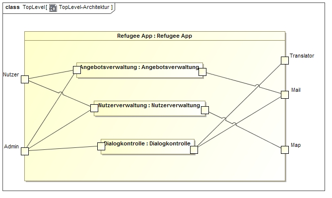

= Entwicklerdokumentation

== Einführung und Ziele
_Aufgabenstellung, Qualitätsziele_

Aufgrund der aktuellen Flüchtlingssituation in Deutschland entstand die Idee eines Projektes zur einfachen Verteilung von Hilfsgütern.
Durch das Projekt soll es möglich sein, dass potenzielle Helfer ihre Hilfsgüter ohne Umwege an Hilfssuchende verteilen können.
Aus diesem Grunde ist es auch von Beginn an als non-profit Modell entworfen worden.

== Randbedingungen
_Hardware-Vorgaben, Software-Vorgaben, Vorgaben zum Betrieb des Software_

* durch Spring-Framework unterstüzte Webanwendung
* primär auf Smartphones benutzbar
* auch Benutzung auch PCs möglich

== Kontextabgrenzung
_Externe Schnittstellen_

* Datenbankanbindung
* Spring
* Webserver

== Lösungsstrategie
_Kurzer Überblick über Ihre grundlegenden Entscheidungen und Lösungsansätze, die jeder, der mit der Architektur zu tun hat, verstanden haben sollte._

* jeder Benutzer hat eine Liste an Hilsfgütern, die er anbietet
* über die Hilfsgüter wird ein Dialog begonnen
* ein Dialog besteht nur aus zwei Personen

== Bausteinsicht
_Package-Diagramme_

== Entwurfsentscheidungen
_Architektur, Verwendete Muster, Persistenz, Benutzeroberfläche_

* Die Benutzeroberfläche wird durch dynamische Webseiten mithilfe von Spring realisiert
* Die Software-Architektur orientiert sich an dem Model-View-Controller Pattern

[appendix]
== Glossar
