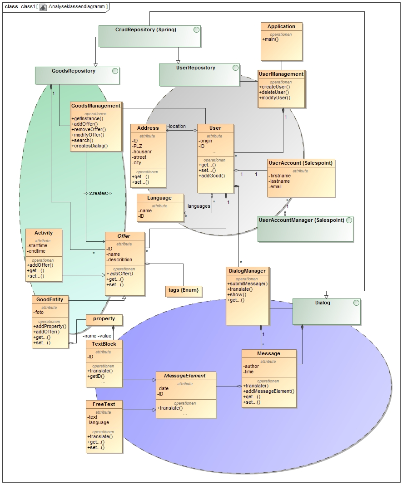

= Pflichtenheft
:toc:
:toc-placement!:

== Refugee App

__Version:__    *0.6*

__Status:__     *In Arbeit*

__Stand:__      *24.11.2015*

== Zusammenfassung
Dies ist das Pflichtenheft zum Projekt "Refugee App".
Es legt die grobe Struktur der Software fest und definiert die Kriterien zur erfolgreichen Beendigung des Projektes.

== Inhaltsverzeichnis

toc::[]

:sectnums:
== Aufgabenstellung und Zielsetzung
Was uns vorschwebt ist eine Art eBay-Kleinanzeigen Portal allerdings multi-lingual - ein Art Welcome- Refugee - Portal, wo Menschen mittels einer Textbaustein-dialog-prinzip und mit Unterstützung von Google Translate in der eigenen Landsprache mit Menschen jeglicher Nationen einfach und unkompliziert in Kontakt treten können, damit so einfach Dinge schnell und unkompliziert direkt ohne Umwege über Sammellager von DRK etc. den Weg zu Bedürftigen finden können. Die Plattform soll aber nicht nur ausschließlich dem Austausch von Gegenständen dienen, sondern auch die Möglichkeit bieten, Angebote zur schnellen Integration der Flüchtlingen bei uns anzubieten z.B. durch das Annoncieren von Deutschkursen etc.

== Fachlicher Überblick
Im Rahmen der aktuellen Flüchtlingssituation kann man sich Gedanken machen, wie man diesen vielen Menschen helfen könnte, welche mit rein gar nichts außer den Sachen am eigenen Leibe bei uns ankommen. Wir leben in einer Überflussgesellschaft und ein jeder hat viele Sachen und Dinge, die leicht zu entbehren sind, da diese schon seit Ewigkeiten im Keller oder Boden stehen, welche jedoch den Menschen hier ein menschenwürdiges Leben ermöglichen würden - angefangen von Anzieh- und Spielsachen für Kinder bis hin zu alten Fahrrädern zur Fortbewegung etc.
Natürlich gibt es bereits viele Hilfsorganisationen, welche Hilfsgüter/Sachspenden sammeln und anschließend verteilen, die man hierfür in Anspruch nehmen kann, allerdings wollen auch viele Menschen einfach direkt selbst helfen, entweder einfach nur in dem man die Hilfsgüter bereitstellt/anbietet oder aber vielleicht auch durch Freizeitangebote um Integrationsmöglichkeiten zu schaffen.
Hierbei scheitert es jedoch oft an den Fremdsprachenkenntnisse der Beteiligten und an einer geeigneten Plattform, um überhaupt erst in Kontakt treten zu können.

== Systemgrenze und Top-Level-Architektur

=== Kontextdiagramm

=== Top-level architecture
image::images/TopLevel-Architektur.jpg[]

== Anwendungsfälle

=== Überblick Anwendungsfalldiagramm
image::images/Anwendungsfälle.jpg[]

=== Akteure
// See http://asciidoctor.org/docs/user-manual/#tables
[options="header"]
|===
|Name |Beschreibung
|Helfer|offeriert Hilfsgüter
|Flüchtling|meldet sich auf Hilfsgüter
|Admin|nimmt Verwaltungsaufgaben wahr
|===

=== Anwendungsfallbeschreibungen
Dieser Unterabschnitt beschreibt die Anwendungsfälle. In dieser Beschreibung müssen noch nicht alle Sonderfälle und Varianten berücksichtigt werden. Schwerpunkt ist es, die wichtigsten Anwendungsfälle des Systems zu finden. Wichtig sind solche Anwendungsfälle, die für den Auftraggeber, den Nutzer den größten Nutzen bringen.
Für komplexere Anwendungsfälle ein UML-Sequenzdiagramm ergänzen.
Einfache Anwendungsfälle mit einem Absatz beschreiben.
Die typischen Anwendungsfälle (Anlegen, Ändern, Löschen) können zu einem einzigen zusammengefasst werden.

== Anforderungen

=== Muss-Kriterien

==== <<neuanmeldung,Nutzermanagement>>

* Erstellen
* Löschen
* Modifizieren
** User sich selbst
** Admin role alle

* Rollen
+
Mindestens User und Admin

==== Kategorien

* <<anzeige,Einteilung>> / Tagging der Güter & Activities
* Vordefinierte Liste an Kategorien

==== <<goods,Item Management>> (Goods & Services)

User mit Zugriff auf eigene + Admin auf alle

* Erstellen
* Löschen
* Bearbeiten

==== Dialoge

* Tracking von Dialog Fortschritt
* Dialogbausteine
* Priorisierung (Antworten auf zuletzt gewählte Bausteine zuerst)
* Dynamische Verknüpfungen der Bausteine (Mit verschiedenen entry points je nach Kontext)
* Modifikation via JSON upload (nicht zwingend notwendig, wenn per GUI implementiert, könnte aber für die GUI das backend sein)

==== Struktur

* Goods
** Übersicht
** Suche
** Abhängig von der Distanz (erwünschte Maximaldistanz sollte einstellbar sein)
** Anzeige
*** Foto hochladen
*** <<attributliste,Vordefinierte Attributliste>>
* Activities
** Übersicht
** Suche
** Anzeige
* Mehrsprachiges interface

=== Kann-Kriterien

==== Kategorien

* Erstellen neuer Kategorien
* Löschen
* Bearbeiten

==== Dialog Management

* Neue Satzfragmente erstellen (GUI)
* Satzfragmente bearbeiten (GUI)
* Vorschläge und Zusammenhänge modifizieren (GUI)

==== Dialog

* Preference based sorting
* Tagging und Kategorisierung
* Chatsystem

==== Struktur
* Activities
** Auflösung/Schließen von activity nach Datum
** Periodische Wiederholung
* Editierbare Übersetzung des Interfaces
* "Suche folgenden Gegenstand" (Gegenteil des Angebot Inserierens)

==== Security

* Feedback zu Nutzern
** Report-System (für unerwünschtes Verhalten)
*** Vulgarität
*** Weiterverkauf für Geld
** Bewertungs-System
*** Hat der Käufer/Verkäufer gemacht was er versprochen hat?
* Aktivitäten Statistik
* Wegwerf E-Mail Addressen Blacklisten

== GUI Prototyp

=== Überblick: Dialoglandkarte
Erstellen Sie ein Übersichtsdiagramm, das das Zusammenspiel Ihrer Masken zur Laufzeit darstellt. Also mit welchen Aktionen zwischen den Masken navigiert wird. Die nachfolgende Abbildung zeigt eine an die Pinnwand gezeichnete Dialoglandkarte. Ihre Karte sollte zusätzlich die Buttons/Funktionen darstellen, mit deren Hilfe Sie zwischen den Masken navigieren.

=== Dialogbeschreibung

==== Startseite
* Logo: TBD
* E-Mail & Kennwort für Login
* Neuanmeldung mit E-Mail Bestätigung Button
* Kennwort vergessen via E-Mail Kennwort-reset-link mit Verfallsdatum Button

[[neuanmeldung]]
==== Neuanmeldung (Schritt)
* Vorname, Name
* E-Mail
* Derzeitige Unterkunft =
+
Flüchtling:: Stadtteil/Plz
Helfender:: Adresse
* Herkunft
* Sprache (Mehrfachauswahl + Präferenz/Ranking)
* ReCaptcha2 für Botdetection

==== Startseite (nach Login)

* Hilfsgüter/Goods Button
* Angebote/Activities Button
* Account management

[[goods]]
==== Goods (ähnlich wie bei eBay-Kleinanzeigen)
* Suchfeld + Kategorie Dropdown
* Umkreis von [in km]
* Angebot einstellen Button

[[anzeige]]
==== Anzeige (Goods & Activities)
* Photo (nur bei Goods zweckmäßig)
* Anbieter, Plz + Ort
* Einstellungsdatum

[[attributliste]]
* Attributelist / Tags zu Größe etc.
** Logisch geordnet: z.B Größen (S, XS, XXL oder “für Kinder geeignet”), Farben (grün etc.), Mengen etc.
** Vorgegeben (drop-down oder auto-complete-select) mit passenden Übersetzungen.
* Freitext beschreibung
* Kontaktaufnahme Button

* Anzeigen löschen/herausnehmen [durch Einsteller + Admin]
* Anzeigen automatisch löschen/herausnehmen nach optionalen Verfallsdatum

==== Kontaktaufnahme/Dialog
* Icons/Text eigene Sprache und vom Gegenüber
* Textbaustein-basierend:
** Textbausteine logisch nach Art der Konversation geordnet z.B. “Begrüßung”, oder “Termin zur Abholung ausmachen” enthält Textbausteine wie “Ich würde gern den Gegenstand am XX” abholen mit XX verschiedenen Option wie Tag + Uhrzeit + Treffpunkt (open streetmap pop-out?).
** Alternativ auch Freitext eingabe mit Möglichkeit der Übersetzung durch GoogleTranslate (integriert)
* Anzeige von vorherigen Gesprächsverlauf ähnlich wie bei Whatsapp u.a. etc.

== Datenmodell

=== Überblick: Klassendiagramm

=== Klassen und Enumerationen
Dieser Abschnitt stellt eine Vereinigung von Glossar und der Beschreibung von Klassen/Enumerationen dar. Jede Klasse und Enumeration wird in Form eines Glossars textuell beschrieben. Zusätzlich werden eventuellen Konsistenz- und Formatierungsregeln aufgeführt.

// See http://asciidoctor.org/docs/user-manual/#tables
[options="header"]
|===
|Klasse/Enumeration|Beschreibung
|Client|
|UserManagement|
|User|
|GoodsManagement|
|adress|
|Language (Enum)|
|Offer|
|Activity|
|Good|
|Tags (Enum)|
|Property|
|Dialog|
|Message|
|MessageElement|
|FreeText|
|TextBlock|
|===

== Aktzeptanztestfälle
Mithilfe von Akzeptanztests wird geprüft, ob die Software die funktionalen Erwartungen und Anforderungen im Gebrauch erfüllt. Diese sollen und können aus den Anwendungsfallbeschreibungen und den UML-Sequenzdiagrammen abgeleitet werden. D.h., pro (komplexen) Anwendungsfall gibt es typischerweise mindestens ein Sequenzdiagramm (welches ein Szenarium beschreibt). Für jedes Szenarium sollte es einen Akzeptanztestfall geben. Listen Sie alle Akzeptanztestfälle in tabellarischer Form auf.
Jeder Testfall soll mit einer ID versehen werde, um später zwischen den Dokumenten (z.B. im Test-Plan) referenzieren zu können.

[options="header"]
|===
|ID  |Akzeptanztestfall         | Beschreibung
|1   |User erstellen            | Es können Benutzer permanent erstellt werden.
|2   |User verändern            | Es können die Eigenschaften und Daten eines Nutzers verändert werden.
|3   |User löschen              | Ein User kann sein eigenes Account löschen.
|4   |Hilfsgut erstellen        | Ein User kann ein Hilfsgut inserieren.
|5   |Hilfsgut verändern        | Ein User kann ein inseriertes Hilfsgut verändern.
|6   |Hilfsgut suchen           | Ein User kann die Menge der Hilfsgüter nach bestimmten Kriterien durchsuchen.
|7   |Hilfsgut löschen          | Ein User kann sein inseriertes Hilfsgut (vorzeitig) löschen.
|8   |Dialog initiieren         | Ein User kann einen Dialog über ein Hilfsgut oder direkt mit einem anderen Benutzer initiieren.
|9   |Dialogbaustein verwenden  | Ein User kann aus einer Menge von vorgegebenen Textbausteinen einen wählen und Platzhalter durch sinnvolle Angaben ergänzen.
|10  |Admin: User untersuchen   | Der Administrator kann die Eigenschaften, Daten und Dialoge eines Users anzeigen lassen.
|11  |Admin: User löschen       | Der Administrator kann einen User löschen.
|12  |Admin: Good untersuchen   | Der Administrator kann ein Hilfsgut untersuchen.
|13  |Admin: Good löschen       | Der Administrator kann unangebrachte Hilfsgüter löschen.
|14  |Oberfläche übersetzbar    | Die Webseiten werden in abhängig von der gewählten Sprache angezeigt.
|15  |Textbausteine erstellen   | Es können neue Textbausteine erstellt werden.
|16  |Textbausteine verändern   | Es können bestehende Textbausteine verändert werden.
|17  |Textbausteine löschen     | Es können bestehende Textbausteine gelöscht werden.
|===

== Offene Punkte
Offene Punkte werden entweder direkt in der Spezifikation notiert. Wenn das Pflichtenheft  zum finalen Review vorgelegt wird, sollte es keine offenen Punkte mehr geben.
